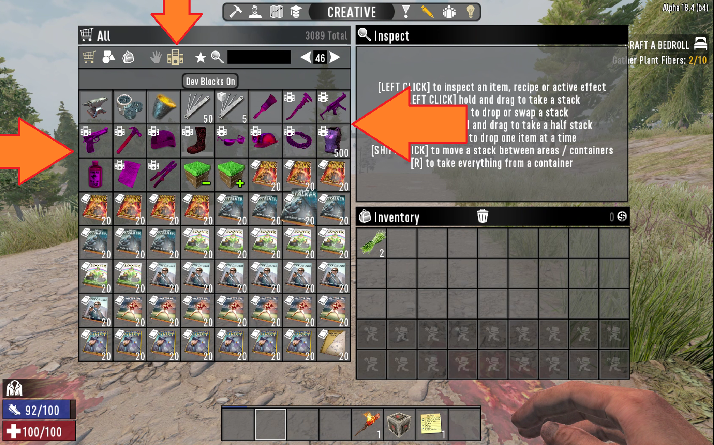

## Creative Menu and Flight

If you are an Administrator in the server.  
You can toogle **Creative Menu** which would allow to Fly around by Pressing `H`  
keyboard key to activate flight mode and pressing `Space` key to fly.  

### Toggle Creative Menu and Flight
While In-game, Press `F1` keyboard button.  
In the **Command Console Prompt** type: `creativemenu`

### Using Dev Blocks
In the Creative Menu it is often not realized that it is possible to toggle Dev Blocks.  
Dev blocks are tools for administrators to efficiently deal with  
the server and have fun while administrating.

## God Mode and Debug Menu
As mentioned if you are an Administrator and are Allowed use **God Mode**.  
You will get the **benefit of invicibility**, after you enable **Debug Menu** for yourself.

### Less talked features
* By Pressing `F5` button you can play in a Third person mode.

### Toggle God Mode and Debug Menu
While In-game, Press `F1` keyboard button.  
In the **Command Console Prompt** type: `debugmenu on`

### Teleportation example
`listplayers`  
`teleportplayer boqsc 1534`  

### Blink teleportation using debugmenu
`W + Shift and press Q` to quickly teleport forward.

### While using `debugmenu` ALT+P would stick your camera to a single position and allow to walk around.

https://user-images.githubusercontent.com/21064622/125424201-f4d6690d-c06f-471d-82e0-c4704b82fa4a.mp4

### Pressing keyboard button: `ALT` will trigger 3rd perspective camera.

https://user-images.githubusercontent.com/21064622/125423819-78db7a20-44dd-4a44-8f59-7af5a169f1c8.mp4

