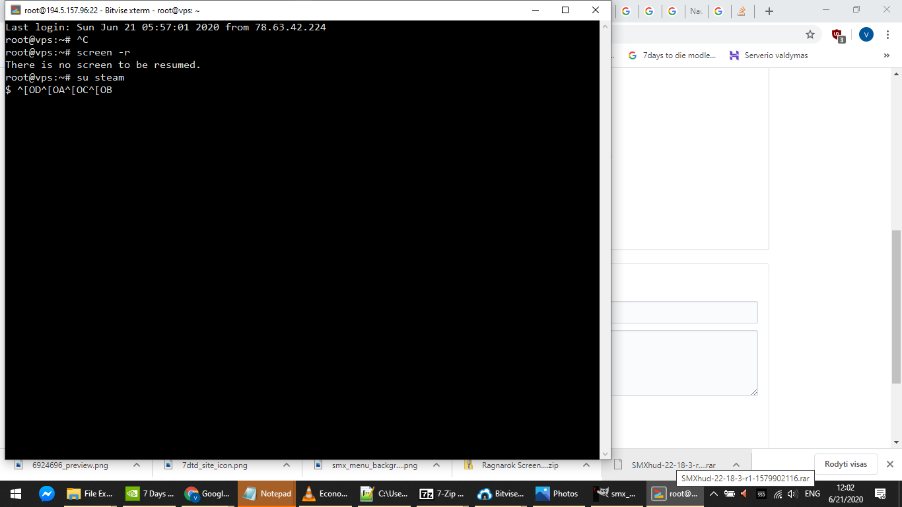

# Tips on managing the Linux server
If you see `$ ^[OD^[OA^[OC^[OB` while searching around command history in the shell using keyboard arrows.  
It is probably because you are using Shell that has no Command History implemented.  
Launch bash and use bash shell to get the command history working.  
By simply typing `bash`, and you will be able to use command history again.  

