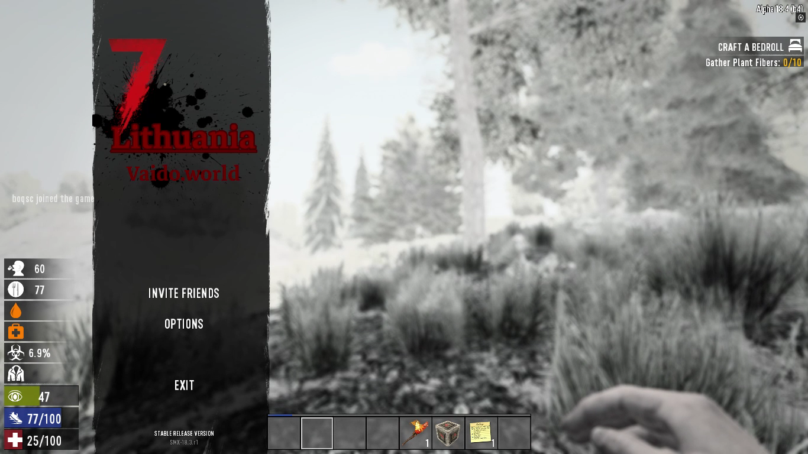

# An ESC menu modification based on SMXmenu Modlet

SMXmenu Modlet: https://www.nexusmods.com/7daystodie/mods/22/?tab=description

## Application
`/home/steam/.steam/steamcmd/7dtd/Mods/SMXmenu/Config/XUi/windows.xml`

Notice: The Image texture has low quality text.

# Zombie Loot Drop Increase A18 (JRB_ZombieLootDrop_25)
https://www.nexusmods.com/7daystodie/mods/168?tab=files
Similar mod: https://7daystodiemods.com/longer-loot-bags/

# Loot-able Zombies (A18)
https://www.nexusmods.com/7daystodie/mods/511?tab=files&file_id=2297

# Starting Items Plus modlet by Nanashi
https://7daystodiemods.com/starting-item-plus/

# Skip the Starter Quest (A18)
https://www.nexusmods.com/7daystodie/mods/512
